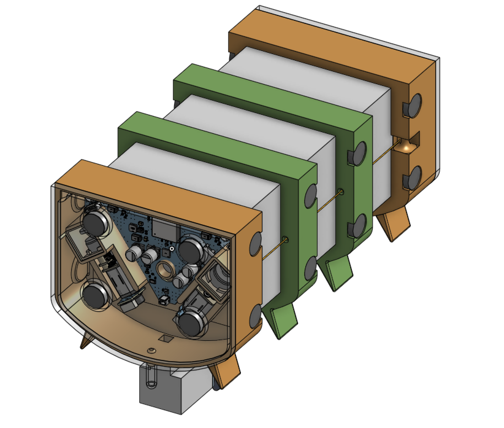

# **SoftRafts CAD Models and 3D Printing Guide**

## 🏗️ Overview

This folder contains **3D models** for all key components of **SoftRafts**, supporting modular design and assembly for soft robotic rafts.

### **🔹 Full SoftRaft Assembly**

---

## 📂 Files in this Folder

* `Whole_SoftRaft.stl` → Assembled complete raft for reference or full printing.
* `Board.stl` → Main base board structure.
* `Tail.stl` → Rear-end module for propulsion or structure.
* `Middle.stl` → Central body segment for structural extension.
* `Motor Cover.stl` → Protective shell for the motor enclosure.
* `Motor.stl` → Motor housing unit.
* `Cover.stl` → General-purpose cover or enclosure.
* `Winch.stl` → Mechanical winch for tensioning or cable deployment.
* `Head.stl` → Frontal module, possibly for sensor mounting.
* `softraft.png` → Rendered image of the complete SoftRaft assembly.

---

## 🔩 **Component Descriptions**

### **1️⃣ Whole Assembly (`Whole_SoftRaft.stl`)**

* Fully assembled reference model combining all modules.
* Use for **scale check, visualization**, or single-print prototypes.

---

### **2️⃣ Modular Parts**

#### `Board.stl`, `Tail.stl`, `Middle.stl`, `Head.stl`

* These represent the **core structural elements** of the raft.
* Can be printed and assembled modularly to form the complete raft body.

#### `Motor.stl` & `Motor Cover.stl`

* Designed to house compact **brushless or geared motors** for thrust or steering.

#### `Winch.stl`

* Winch mechanism base to integrate cable or string-based actuation or payload release.

#### `Cover.stl`

* A universal part used to seal components such as battery chambers or electronics.

**🔧 General Printing Guidelines for All Parts:**

* **Material**: PLA or PETG for general use; ABS or ASA or Resin for waterproof versions
* **Layer Height**: 0.15–0.2 mm
* **Supports**: Enabled for overhangs (e.g., motor housing)

---

## 🔧 **Modifying the CAD Models**

* For Fusion 360 or SolidWorks editing, convert STL to mesh body or re-model using `Whole_SoftRaft.stl` as reference.
* Recommended to re-export assemblies from native CAD format for major modifications.

